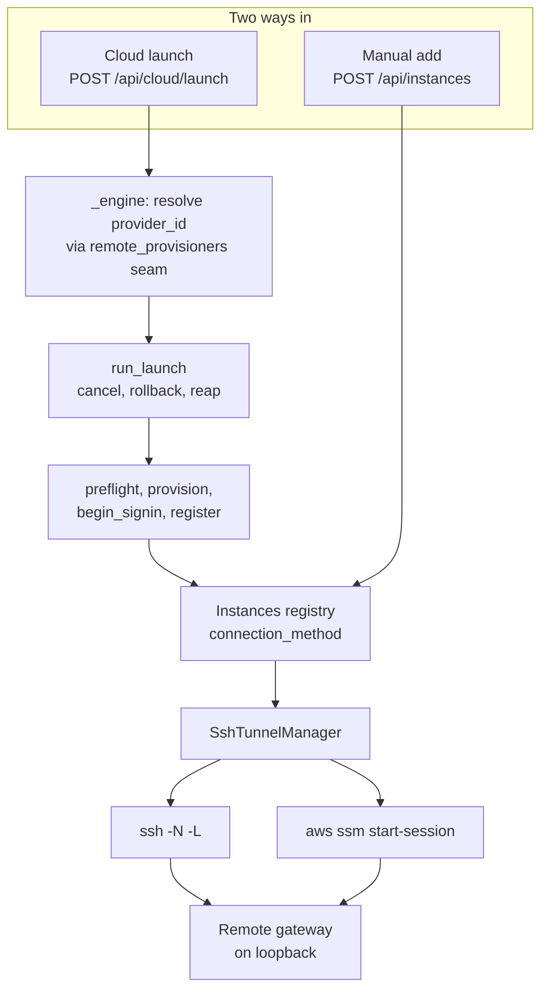

# Adding a remote-provisioner lane

A **remote instance** registry record names an execution target this gateway can reach through a loopback tunnel. Usually that target runs a complete Kiro Crew gateway; the `fargate` connection method instead reaches a crew container's turn API. A human can type coordinates into **Settings → Remote Crew**, while a **provisioner** can create the target first and register it afterwards. The stock Fargate launch engine is the current exception: it creates a task but leaves registry registration manual, tracked in #12511.

The stock build always ships the EC2 provisioner and also exposes the Fargate provisioner when `cloud.json` contains a complete `fargate` block. This guide is for the case where you need another lane — a managed dev-environment service, a fleet API, a different container platform — and it answers three questions in order: how a remote instance is reached today, which parts of that are an interface you may implement, and what a new lane actually has to write.

The short version: you supply a **descriptor** and a **`LaunchEngine`**, and nothing else. The launch loop, cancellation, rollback, one-launch-at-a-time and orphan reaping stay in core and apply to your lane whether you thought about them or not. Everything you add belongs in an edition or companion package, never in core.

## A. How a remote instance is reached today

### The registry is the single destination

`src/kiro_crew/instances/registry.py` holds the records. One `Instance` dataclass describes one remote, and `CONNECTION_METHODS` is `("ssh", "ssm", "fargate")`. Those are three connection methods over two forwarding mechanisms: `ssh` uses OpenSSH, while `ssm` and `fargate` use AWS Systems Manager port forwarding. Which fields matter depends on which method the record names:

| Connection method | Fields it uses | What reachability depends on |
|---|---|---|
| `ssh` (the default) | `ssh_host`, `remote_bin` | An SSH key, a reachable port, and whatever `~/.ssh/config` says |
| `ssm` | `ssm_target`, `aws_profile`, `aws_region`, `ssm_run_as` | IAM (`ssm:StartSession`) plus the SSM agent on the box |
| `fargate` | `ssm_target`, `aws_profile`, `aws_region` | IAM plus an ECS task target (`ecs:<cluster>_<task-id>_<runtime-id>`); the task exposes a turn API, not a dashboard |

All three share `remote_port`, `local_port` and `ttl`. `Instance.validate` enforces the split: an `ssh` record needs a well-formed `ssh_host`, an `ssm` record needs an EC2 or managed-instance id, and a `fargate` record needs the ECS task-target shape. No credential is ever written to the registry — records hold coordinates only.

### One tunnel manager, transport chosen per record

`src/kiro_crew/instances/ssh_tunnel_manager.py` supervises one child process per connected instance and forwards a loopback port. `SshTunnelManager` reads each record's `connection_method` and builds either an `ssh -N -L` argv or an `aws ssm start-session` port-forward argv. For `fargate`, the latter targets an ECS task and exposes its turn API; the manager deliberately skips dashboard-token minting and remote-gateway restart logic because the task has neither. The class name is historical; it is transport-neutral in behaviour.

This matters for a new lane: **you do not write a transport.** You pick one of the three supported connection methods at registration time, and the existing manager takes it from there.

### Two entry points, one registry

Manual add is `POST /api/instances`, handled by `src/kiro_crew/dashboard/handlers_instances.py::api_instances_add`. It defaults `connection_method` to `"ssh"` and passes the body straight to `InstancesRegistry.add`. No machine is created; the user already has one.

Provisioned launch ends at `LaunchEngine.register`, and the built-in implementation calls `src/kiro_crew/cloud/connect.py::register_instance`, which defaults `connection_method` to `"ssm"` and uses the EC2 instance id as `ssm_target`. `connection_method` is a keyword, so a lane whose crew is reached another way passes its own — the Fargate lane passes `"fargate"` with an ECS task target. Either way the value lands in `ssm_target`, which is what the record is matched on: it is idempotent per box, so a re-launch updates the existing record in place rather than accumulating duplicates.

### The provisioning seam

`src/kiro_crew/cloud/launch_job.py::LaunchEngine` is a five-method Protocol: `preflight`, `provision`, `begin_signin`, `register`, `teardown`. It is driven by `src/kiro_crew/cloud/launch_job.py::run_launch`, and that function is where the operational machinery lives — cancel checks between steps, the two rollback paths (`_rollback_cancelled_stack` for a user cancel, `_rollback_failed_provision` for a provision that died after creating something), and `LaunchJobStore.reap_orphans` for jobs left non-terminal by a gateway kill. One-launch-at-a-time is enforced above it, in `src/kiro_crew/dashboard/handlers_cloud.py::api_cloud_launch_create`, under `_launch_lock`.

Which engine runs is a Composable Platform Provider seam. `src/kiro_crew/platform/interfaces.py::RemoteProvisioner` is the descriptor and `src/kiro_crew/platform/interfaces.py::RemoteProvisionerProvider` is the two-method provider Protocol. The public default is `src/kiro_crew/platform/defaults.py::DefaultRemoteProvisionerProvider`, which always lists the EC2 descriptor and conditionally lists Fargate when its configuration is complete. It hands out `src/kiro_crew/cloud/launch_engine.py::RealLaunchEngine` or `src/kiro_crew/cloud/fargate_engine.py::FargateLaunchEngine` for those ids. Resolution happens in `src/kiro_crew/dashboard/handlers_cloud.py::_engine`.

The API surface is two routes: `GET /api/cloud/provisioners` lists the descriptors, including any `confirm_before_launch` value, and `POST /api/cloud/launch` takes a `provider_id` plus an optional `confirm_recipient` and re-resolves the id against the same seam before any job file is written. An id the provider lists but cannot back is rejected with `unknown_provisioner` at 400, before a job exists. When a descriptor names a credential recipient, the handler requires the exact confirmation before persisting a job and the engine must verify it again against what it is about to run.

On the frontend, `website/src/components/remoteProvisionerRenderers.tsx` is a registry of form components keyed by the descriptor's `kind`, not its `id` — so several rows can share one form. `aws_ec2` is drawn by the core's own panel and `registerRemoteProvisionerRenderer` **refuses** it: claiming that form would be a collision, not an override. That refusal is a frontend one. On the backend, `provisioners()` is trusted — a second descriptor under the id `aws_ec2` is not rejected, it is simply not something you may do (the id's own docstring says so), and doing it anyway leaves `api_cloud_launch_create` resolving whichever row it reaches first. A `kind` with no renderer is skipped by the selector, so an older frontend shows an edition's new lane as absent rather than as a broken panel.

### The whole path



## B. The interfaces

### `RemoteProvisioner` — the descriptor

A descriptor says which lanes exist and how to draw each one. It never says how a machine is created.

| Field | Meaning | Who reads it | Fixed or yours |
|---|---|---|---|
| `id` | The identifier a launch request names as `provider_id` | `api_cloud_launch_create`, and a future governance scope | Yours; `aws_ec2` is reserved by convention, unenforced on the backend |
| `kind` | Which frontend form draws this lane | `canRenderRemoteProvisionerKind`, `getRemoteProvisionerRenderer` | Yours; `aws_ec2` is refused by the renderer registry |
| `label` | Untranslated display name on the selector | The Set-up tab selector | Yours; edition-owned copy, deliberately outside the core catalog |
| `posix_only` | Whether a launch may run on a Windows gateway | `api_cloud_launch_create`, per descriptor | Yours; the built-in shells to `bash` and `aws`, so it is `True` |
| `step_labels` | Overrides the user-facing label of any of the four launch steps | `default_steps` | Labels are yours, keys are not |
| `confirm_before_launch` | Exact credential recipient the operator must see and confirm, or `""` | Provisioner list, launch handler, and `engine_for` | Yours; use it when configuration chooses where a model credential is delivered |

### `RemoteProvisionerProvider` — the provider

| Method | Must return | Failure contract |
|---|---|---|
| `provisioners()` | Descriptors in display order | A degraded read falls back to the built-in descriptor alone, so the AWS tab keeps working rather than emptying |
| `engine_for(provisioner_id, *, confirmed_recipient="")` | The `LaunchEngine` for that id | Raise `KeyError` for an unknown id; the handler answers 400 `unknown_provisioner`. A provider that declares a recipient must accept and pass through the confirmation |

### `LaunchEngine` — the five methods

| Method | What core does with the return | Must guarantee |
|---|---|---|
| `preflight(profile, region)` | Fails the launch on any raise | Raise if the launch cannot possibly succeed. Run your own authorization here; a frontend form cannot skip a check by not drawing it |
| `provision(tag, size_key, profile, region)` | Stored as `job.instance_id`, passed to `begin_signin` and `register` | Return the identity `register` accepts. **Also tag the resource with `tag`** — that is the only handle `teardown` gets. Validate your own `size_key` here |
| `begin_signin(instance_id, profile, region, login_target=None)` | Reads `already_logged_in`, `error`, `url`, `code`, `ports`; calls `wait(cancel)` then `close()`; on a **cancelled** sign-in calls `abort()` first | Return a `SigninHandle` — **do not raise for a sign-in that merely did not complete.** Honor the requested identity or declare an unsupported non-default target so preflight fails before provisioning. Set `already_logged_in` when there is nothing to do; leave `url` empty to skip without blocking. `abort()` must answer whether the login on the box is confirmed stopped; see *The sign-in handle* below |
| `register(instance_id, tag, profile, region)` | Nothing — it is the last step | **Raise loudly if the registry write fails.** `register_instance` is best-effort by contract and returns `None` on failure; swallowing that marks the launch done while the user pays for an invisible machine. Raise `launch_job.RegistrationUnavailable` instead, and only instead, when your lane can say the launch itself is sound and only the row is missing: the launcher then reports the resource as launched with the reason on the connect step. Any other exception fails the launch |
| `teardown(tag, profile, region)` | `True` is reported to the user as removed | Return `True` only when the resource is **confirmed** gone. An accepted delete request that later fails is not a `True`. Note it receives `tag`, never `provision`'s return. If your `register` writes an Instances record, remove it here too: `register` is the last step, so a cancel observed just after it unwinds through `teardown` with the row already written, and a stopped resource that keeps its row leaves a crew entry addressing nothing |

### The four step keys are fixed

`preflight`, `provision`, `signin` and `connect` are the step keys, and rollback branches on them: `run_launch` rolls back only when the `provision` step is the one that failed, because a later failure means the machine exists and `register` has already named it for recovery. Rename a key and that branch stops matching. `step_labels` lets you relabel any of the four so a lane that does not create an EC2 instance is not described as one.

Note the asymmetry: `register` runs during the step keyed `connect`. There is no `register` step.

### `tag` is the teardown handle, and rollback has one blind spot

Two facts about `run_launch` that together decide how your engine must behave.

**`teardown` never sees what `provision` returned.** Core generates `tag` (a short `kc-…` string) before `preflight` and passes it to `provision` and to `teardown`; `provision`'s return value goes to `job.instance_id` and from there to `begin_signin` and `register` only. So a resource your engine can find *only* by the identity it returned is a resource rollback cannot delete. Tag it with `tag` at creation, or key it on `tag` some other way, and make `teardown` idempotent — running it against a `tag` that created nothing must be a no-op that returns cleanly.

**A raise after `provision` succeeds is not rolled back.** Rollback is scoped to `job.step("provision").state == "failed"`, on the reasoning that a later failure means the machine exists and `register` has already named it for manual recovery. That reasoning holds for a `register` failure. It does **not** hold for a raise out of `begin_signin`, which happens *before* `register` — the machine exists, nothing rolls it back, and nothing put it in the registry either. Your `begin_signin` must therefore not raise for a sign-in that merely failed to complete: return a handle whose `wait` returns `False` and the launch continues to `register`, which is the outcome the user can recover from. Reserve a raise for the case where the machine itself is unusable, and tear it down yourself before you raise.

A user *cancel* during sign-in is handled: `run_launch` rolls back whenever the `provision` step has moved past `pending`. Only the raise path has the gap.

### `size_key`, `profile` and `region` are generic wires

They are named for the built-in lane but are not owned by it. For `aws_ec2` they are the EC2 size ladder, an AWS profile and an AWS region. For your lane they are whatever shape vocabulary, credential selector and placement you need. `LaunchJobStore.create` validates `size_key` against `src/kiro_crew/cloud/sizes.py` **only** when `provider_id` is the built-in id — validating every lane against the EC2 table would refuse every non-EC2 launch. Your engine validates its own in `provision`.

## C. The lanes that exist today, and what each one uses

| Lane | Provisions? | Registers as | Where it lives |
|---|---|---|---|
| Manual SSH instance (a developer's own EC2, a dev desktop) | No | `ssh` | `handlers_instances.py::api_instances_add` |
| Manual SSM instance | No | `ssm` | Same handler, `connection_method="ssm"` in the body |
| Built-in `aws_ec2` | Yes — CloudFormation deploy | `ssm` | `src/kiro_crew/cloud/launch_engine.py::RealLaunchEngine` |
| Remote Instance on Fargate | Yes — ECS task, offered only when `cloud.json` configures it | `fargate` — the task's ECS target, registered at launch | `src/kiro_crew/cloud/fargate_engine.py::FargateLaunchEngine`, designed in [rfc-remote-instance-on-fargate.md](../request-for-change/rfc-remote-instance-on-fargate.md) |

The Fargate RFC is **in progress**. Its front matter says `status: in-progress` with `implementation-prs: [9223]`, and the lane is partly shipped: `DefaultRemoteProvisionerProvider.provisioners()` appends the `aws_fargate` descriptor once `cloud.json` carries a complete `fargate` block, and `engine_for` hands out `src/kiro_crew/cloud/fargate_engine.py::FargateLaunchEngine` for it. The engine starts a task whose model credential is injected at run time, so its sign-in handle completes immediately. Its `register` reads the started task with `DescribeTasks` until the crew container reports a `runtimeId`, then registers `ecs:<cluster>_<task-id>_<runtime-id>` with `connection_method="fargate"` and the task definition's published port; the launch job also stores the task ARN, and `GET /api/cloud/launch/{id}/task` reads that task's current ECS state, which a registry record naming one task cannot report. A registration that cannot complete leaves the launch reported as launched with the reason on its connect step, because the task is running and billing either way. No `registerRemoteProvisionerRenderer` claims the Fargate `kind`, so the lane is reachable through the API and absent from the Set-up selector.

Two adjacent pieces of work are easy to mistake for a provisioner lane, so state it plainly: the **crew bundle builder** under `src/kiro_crew/apps/builtins/aws_control/crew/packaging/` (merged as #9213) and the **crew container runtime** added by PR #9223 (merged) are the bundle and image side. Neither implements `LaunchEngine` and neither writes to the instances registry — a search of the `aws_control` app for `LaunchEngine`, `register_instance` or `InstancesRegistry` returns nothing on `main`, and the same search across #9223's diff returns nothing either. They produce something a lane could one day run; they are not a lane.

### Lifecycle routes are not part of the seam

The stop, start and delete routes under `/api/cloud/{tag}/...` are EC2-specific — they take a CloudFormation stack tag and talk to EC2. Fargate has the read-only `GET /api/cloud/launch/{id}/task` route, resolved by engine capability rather than by a hard-coded provider id. A lane that needs other lifecycle actions contributes its own routes through the `dashboard` seam's `contribute_routes`.

There is also **no** `capabilities.remote_provisioners` governance scope today. The existing lanes carry none, and the spec names a row mirroring `capabilities.mobile_connect` as the natural follow-up for narrowing provisioners independently. If your lane needs to be governable, that scope is work you are adding, not work you are inheriting.

## D. Adding a lane

Custom lanes go in an edition or companion package. Core owns EC2 and the conditionally exposed Fargate lane; deployment-specific additions do not belong in core.

### 1. Write the descriptor

```python
from kiro_crew.platform.interfaces import RemoteProvisioner

MY_LANE = RemoteProvisioner(
    id="my_lane",
    kind="my_lane",
    label="My managed environment",
    posix_only=False,
    step_labels=(
        ("provision", "Request an environment"),
        ("connect", "Add it to your crews"),
    ),
)
```

If configuration chooses the image, service or account that receives a model credential, set `confirm_before_launch` to the exact user-visible recipient. The launch request must echo that value as `confirm_recipient`, and the engine must compare it with what it is about to run before any durable cloud write.

Pick `posix_only=False` only if your engine genuinely runs on a Windows gateway. Relabel any step whose default wording lies about your lane.

### 2. Implement `RemoteProvisionerProvider` and swap it in

```python
class MyProvisionerProvider:
    def provisioners(self):
        return [MY_LANE]          # or [MY_LANE, BUILTIN_REMOTE_PROVISIONER]

    def engine_for(self, provisioner_id, *, confirmed_recipient=""):
        if provisioner_id != "my_lane":
            raise KeyError(provisioner_id)
        return MyLaunchEngine(confirmed_recipient=confirmed_recipient)
```

A lane with no credential recipient may ignore the default-empty keyword. A lane whose descriptor sets `confirm_before_launch` passes it into the engine unchanged; it must not re-read the same configuration and let that file confirm itself.

Replace the default during composition with `dataclasses.replace(ctx, remote_provisioners=MyProvisionerProvider())`. Returning a list **without** the built-in withdraws the AWS lane, which is the right move on a fleet whose users have no AWS account of their own.

### 3. Implement the `LaunchEngine`

Five methods, with the guarantees from the table in section B. Three are worth restating because getting them wrong costs the user money:

`teardown` must confirm, and must work from `tag` alone. Requesting a delete and returning `True` tells the user their billing stopped when the resource may still be running; and a resource findable only by `provision`'s return value is one rollback cannot reach.

`register` must raise on failure. Mirror `RealLaunchEngine.register`: it checks `register_instance`'s return for `None` and raises a message naming the resource, so a machine that was created but never registered is still recoverable by hand. Which exception decides whether the launch fails with it: `launch_job.RegistrationUnavailable` keeps the launch reported as launched and puts the reason on the connect step, and everything else fails the launch. Reach for it only when the resource exists and is sound, as `FargateLaunchEngine.register` does — a lane that cannot tell the two apart should raise the fatal kind, because a launch wrongly reported as done is worse than one wrongly reported as failed.

`begin_signin` must not raise for an incomplete sign-in. It runs after `provision` and before `register`, which is the one window rollback does not cover.

If the lane delivers a credential selected by configuration, `provision` must refuse an empty or mismatched `confirmed_recipient` before registering, starting or otherwise persisting any cloud resource.

### The sign-in handle

`begin_signin` returns a `src/kiro_crew/cloud/launch_job.py::SigninHandle`. Core reads its `already_logged_in`, `error`, `url`, `code` and `ports`, calls `wait(cancel)` while a code is being polled, and always calls `close()`. One more method is part of the contract and easy to miss because the happy path never calls it:

`abort() -> bool` runs **only when the user cancels** a launch or a sign-in retry while a login may be polling on the box. It must stop that login — the built-in lane runs `cancel_device_login`, which kills the `kiro-cli login` process and removes its code files **without** signing the box out — and return `True` only when the stop is **confirmed**. Anything else (`False`, `None`, a raise, a missing method) is recorded on the job as `ABORT_UNCONFIRMED_NOTE`: "the Kiro sign-in on the instance was NOT confirmed stopped", with a warning in the gateway log. Core never infers a clean stop from silence, because a device code left polling can sign the crew in minutes after the owner said no.

A lane whose sign-in involves **no remote login** — one that hands the box a credential at provision time, say, and whose `begin_signin` answers `already_logged_in` — should still implement `abort()` and return `True`, with the reason in its docstring: there was never a login to stop, so the stop is trivially confirmed. `src/kiro_crew/cloud/fargate_engine.py::FargateSigninHandle.abort` is the in-tree example. Do **not** leave the method off and rely on the fallback: that fallback is the unconfirmed note, and its text is about a polling device code your lane does not have.

### 4. Choose the transport at `register` time

| Choose | When |
|---|---|
| `ssm` | The machine is an EC2 instance or an SSM-managed instance in an AWS account the user's credentials reach. Buys you no inbound port, no SSH key, and reachability as an IAM decision |
| `ssh` | Anything else — a container task, a managed environment, a machine outside AWS. Needs a reachable host and a key, but is the only option when there is no SSM agent |
| `fargate` | An ECS task exposing the Kiro Crew turn API and addressed by an ECS task target. It uses the SSM forwarder but has no dashboard token or remote `kirocrew` process |

Set `remote_port` to the port your gateway actually binds. The two ends of one instance must name the same port or the tunnel forwards to nothing.

### 5. Register a frontend renderer

Call `registerRemoteProvisionerRenderer` from `website/src/components/remoteProvisionerRenderers.tsx` at module load during composition, keyed on your descriptor's `kind`. Your form receives the `provisioner` row and a `launch({ profile?, region?, size_key })` callback; the panel supplies `provider_id` from the row and fills omitted fields with `''`, so a lane with no profile or region concept posts `size_key` alone. The progress card and error notice are drawn by the panel, not by your form.

### 6. Contribute lifecycle routes if you need them

Mount them through `contribute_routes` on the `dashboard` seam. Do not extend `/api/cloud/{tag}/...`; those are EC2's.

### 7. Test it

Mirror the two existing suites. `test/test_remote_provisioner_seam.py` covers the descriptor, the default provider and composition — that the built-in descriptor is what it claims, that `engine_for` raises `KeyError` for an unknown id, and that `dataclasses.replace` on the base context swaps the provider (its own `Two` fixture is the shape to copy). `test/test_cloud_handlers.py::TestProvisionerSeam` covers the handler behaviour: that `GET /api/cloud/provisioners` lists your row, that `POST /api/cloud/launch` with your `provider_id` reaches your engine, and that an unknown id is a 400 before a job file exists.

Add two of your own that the existing suites cannot cover for you: that `teardown` finds and removes a resource given only `tag`, and that a failed sign-in leaves the instance registered rather than raising.

Inject a fake engine through `state.cloud_launch_engine`, which outranks the seam, when you want to exercise `run_launch` without composing a whole context.

## E. Two worked examples

### Example 1: the current Fargate lane

The shipped engine currently behaves as follows:

| Method | Fargate | What changes from EC2 |
|---|---|---|
| `preflight` | Validate the region and require a complete launch spec | No ECS call is made |
| `provision` | Register a task definition, RunTask, return the task identity | Minutes of bootstrap become an image pull |
| `begin_signin` | Return `already_logged_in=True`; the container receives its API key at run time | No browser or device-code flow |
| `register` | No-op today; the launch job retains the task ARN | Registry wiring is tracked in #12511 |
| `teardown` | StopTask | Stack deletion becomes an API call |

`size_key` maps to a CPU and memory pair instead of an instance type, which is exactly the "generic wire" case from section B. Fargate accepts the interactive `light`/`balanced`/`power` keys and its own `<cpu>/<memory>[/<ephemeral-storage-gib>]` spelling; `LaunchJobStore.create` validates keys against the EC2 ladder only for the built-in EC2 id.

The RFC's own acceptance conditions are worth copying for any lane: `provision` returns an identity `register` accepts, `teardown` leaves nothing in use, and a partial teardown is recoverable — running it twice removes the remainder rather than erroring. That last one is not optional politeness: rollback can call `teardown` for a `tag` whose `provision` created nothing at all.

### Example 2: a managed dev-environment service, reached over SSH

The setup: a service hands out a machine from a prebuilt image that already contains Kiro Crew, reachable over SSH. This is the lane where the seam earns the most, because most of the work is already done by the image.

| Method | What it does |
|---|---|
| `preflight` | Check the service is reachable and the caller is entitled to an environment. Raise otherwise |
| `provision` | Ask the service for an environment, label it with `tag`, return its id. No bootstrap — the image already carries the runtime |
| `begin_signin` | **Still required.** The image carries the runtime, not the user's model credential. Start the device-code flow on the new machine and return the handle |
| `register` | `connection_method="ssh"`, `ssh_host` set to the address the service gave you, `remote_port` set to the port the image's gateway binds. `remote_bin` only if the binary is somewhere non-standard |
| `teardown` | Release the environment back to the service, looked up by `tag` — so `provision` must record `tag` on the environment. Return `True` only once the service confirms it is released |

The two things people get wrong here:

**Skipping `begin_signin` because "the image has everything".** It has the software. It does not have the user's credential, and a machine that comes up unsigned-in looks like a successful launch and behaves like a broken one. `run_launch` already handles the cheap path: set `already_logged_in` on the handle and the step completes immediately. What it does not handle is a raise here — see the rollback blind spot in section B: raising out of `begin_signin` leaves a leased environment that is neither registered nor released.

**Assuming a light bootstrap means a light `teardown`.** A prebuilt image makes `provision` fast; it does nothing for the confirmation `teardown` owes. A leased environment that was never released keeps billing exactly like an EC2 instance would.

## Where to look next

- [platform-context.md](../system-specs/modules/platform-context.md) — the `remote_provisioners` seam alongside the other Composable Platform Provider slots, and the reasoning behind the fixed step keys.
- [instances.md](../system-specs/modules/instances.md) — the registry, the transports, and the full API surface.
- [cloud-instance-ssm-vs-ssh.md](cloud-instance-ssm-vs-ssh.md) — the two transports from the user's side, and why a launched box uses SSM.
- [remote-crew-on-ec2.md](remote-crew-on-ec2.md) — the setup gotchas a new lane's `register` should avoid recreating.
