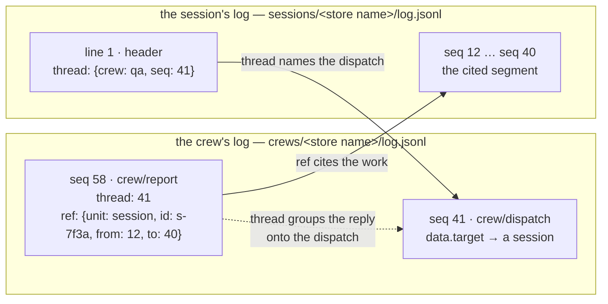

# Crew log reference

**Local page, not a mirror.** This directory is Kiro Crew's own documentation and
has no upstream source, so a re-fetch of the `kiro-cli/` mirror must leave it
alone. It is marked as a named exception in [the Reference index](../README.md).

A crew log is one append-only history per unit, stored as one or more JSONL
segments. A writer adds lines to the active segment and never rewrites a committed
line, so the log — not a context window, not a summary — is the authority for what
happened to that unit. Every entry after a segment header carries a writer-assigned
`seq`, so a reader folds the segments in `seq` order and gets one reading of the
unit's history.

These pages say WHAT the format is. For WHY it is shaped this way, read
[`crew-log-core.md`](../../system-specs/modules/crew-log-core.md) and
[`crew-log-emitter.md`](../../system-specs/modules/crew-log-emitter.md).
For how a session's file is FOLDED into the views a reader sees, and the routes
and frame that serve them, read
[`crew-log-projection.md`](../../system-specs/modules/crew-log-projection.md).

## Contents

| Page | What it covers |
|---|---|
| [envelope.md](envelope.md) | File layout, header fields, the eight common entry fields, `ref` and `thread`. Kind-independent. |
| [session-types.md](session-types.md) | Every session log entry type, one subsection each, with fields and an example. |
| [crew-types.md](crew-types.md) | The crew's log's type families and the two dispatch contracts. |
| [member-event-log](../../system-specs/modules/member-event-log.md) | The canonical `member`-kind vocabulary, projections, migration, and multi-writer adapter. |
| [reading-and-writing.md](reading-and-writing.md) | Reader API, writer rules, ownership, and the fail-soft emitter. |
| [errors.md](errors.md) | Every `CrewLogError` code, its trigger, and what a caller does about it. |
| [reading-from-an-agent.md](reading-from-an-agent.md) | The read-only `kirocrew-crew-log` MCP server: its three tools, their caps and codes, who may read what, and the one-line agent-spec grant. |

## Glossary

**crew log** — the storage layer (`kiro_crew.crew_log`): a file format, the rules for
who may write what, and the read-back paths. "Append-only log" names the same
thing; these pages say *crew log* throughout.

**unit** — the thing a crew log belongs to. One unit, one crew log.

**kind** — which unit type a crew log is: `crew`, `session` or `member`. A kind
decides which `type` domains may be written to the file and which `src` values may
write them.

**the session's log** — a `session`-kind crew log, keyed by an ACP session id,
recording one session's turn lifecycle. [session-types.md](session-types.md)
covers it.

**the crew's log** — a `crew`-kind crew log. Same envelope, different type domains, and
the place `thread` and guest-namespaced types are used.
[crew-types.md](crew-types.md) covers it.

**the member's log** — a `member`-kind crew log keyed by a member slug. It uses
the same storage and envelope, while the [member event log specification](../../system-specs/modules/member-event-log.md)
owns its event vocabulary and projections.

**entry** — one line after the header: an envelope plus a type-specific `data`
object.

**segment** — one physical file in a unit's crew log. A unit's history may span
several, read oldest first. Every segment repeats the header.

**opener / closer** — a pair of types where one records that something started and
the other that it ended. A closer is what makes an interrupted opener detectable.

## What a crew log is not

It is not the **SEL security audit log**, which records security-relevant
decisions for an auditor and answers a different question.

It is not a **session transcript**. Transcripts are message-grain, are rewritten
by rotation and compaction, and are a best-effort shadow of what a session slot
held. A crew log is operation-grain and append-only.

It is not the **per-turn usage row store**, which measures token and credit cost
per turn for reporting.

It is not a **global event stream**. A day-sharded stream of lifecycle events
joined by a correlation key is a different shape: it has no per-unit `seq`, so it
cannot be folded into one unit's authoritative history. No emitter writes the same
fact to both.

## The pointer model

An entry cites another crew log with `ref`. A session's header points back at the
crew row that dispatched it with `thread`. Neither copies bytes: both name a
location, and a reader that wants the content goes and reads it.

Two things are worth reading off that diagram. The `ref` is the one deliberate
cross-kind pointer: a crew entry cites a span of a session's file. The `thread` is
always within-file — `crew/report` threads onto `crew/dispatch` because both are
lines in the crew's log — except on the session *header*, where `thread` is a
back-pointer naming a row in another unit and is spelled `{crew, seq}` rather than
a bare int.

## Guarantees

Each guarantee names the error a caller gets when it is enforced against them.

**Append-only.** A writer adds lines. Nothing already written is rewritten in
place, so a reader that has folded up to `seq` N never has to re-read below N.

**`seq` is contiguous from 1, and one writer owns a file.** Seq is assigned under
the unit's lock as `last_seq + 1`, read back from the file's own tail rather than
from a cached counter. A second process that tries to append gets
[`already_owned`](errors.md#already_owned) and appends nothing. A gap between two
segments mid-chain is damage, not a pruned log:
[`segment_gap`](errors.md#segment_gap).

**Crash closers are deterministic.** Opening a session's log with repair on
truncates a torn tail, drops a trailing orphan chunk run, and writes one closer
per still-open opener with a fixed value per type. The same file always repairs to
the same bytes. See [reading-and-writing.md](reading-and-writing.md#crash-repair).

**An oversize entry is refused, never truncated.** The serialized line ceiling is
64 KiB (`MAX_ENTRY_BYTES`). A line over it raises
[`entry_too_large`](errors.md#entry_too_large) before any byte is written, so a
reader never meets a half-recorded fact. An oversize *body* is split into
`message/chunk` entries by the emitter instead of being clipped.

**A `ref` spans at most 500 lines** (`MAX_REF_SPAN`). A citation is a pointer, not
a bulk export; a wider span raises [`bad_ref`](errors.md#bad_ref).

**A reader is never handed an entry it cannot interpret.** A reader that declares
the types it knows gets [`unknown_entry_type`](errors.md#unknown_entry_type) on an
unknown entry, unless the writer marked that entry `ignorable`. Reconstruction
stops rather than silently skipping a line that may change the meaning of every
line after it.

**Every file identifies its own unit.** Line 1 names the kind and the id, and each
segment repeats it. A header that names a different unit, or a version this build
does not read, is refused: [`bad_header`](errors.md#bad_header),
[`bad_segment`](errors.md#bad_segment),
[`unsupported_version`](errors.md#unsupported_version).

**Agent file tools cannot reach `crew-log/`.** The whole root is a fenced leaf in
the shared sensitive-path floor, so a prompt-injected agent cannot read another
unit's history or forge a line into its own. The crew log's own code opens the files
directly and is unaffected.

**Session emission is off by default.** The session emitter is inert unless
`KIROCREW_CREW_LOG` is truthy. With the flag unset it creates no `session` unit and
no session emit path reaches storage. The `member` event log is independent of
that flag and continues to use the same store.

**The session vocabulary is PRE-RELEASE.** Its shapes may change while session
emission remains off by default. The shipped member-log contract is canonical in
[member-event-log.md](../../system-specs/modules/member-event-log.md).
